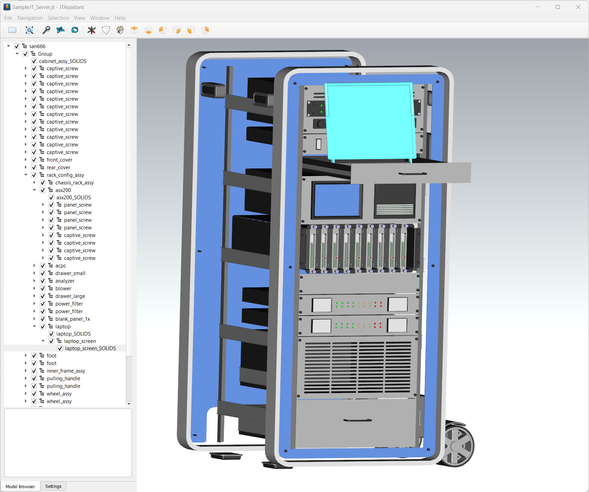

# PyOpenJt

**TOC**

1. [Introduction](#Introduction)
2. [Jt](#Jt)
3. [Getting Started](#Getting-Started)
4. [License](#License)

  
## Introduction  

### Purpose 

The purpose of this library is to make the huge body of Work in [PDM](https://en.wikipedia.org/wiki/Product_data_management) systems of big [OEMs](https://en.wikipedia.org/wiki/Original_equipment_manufacturer) accessibly to downstream [visualization systems](https://en.wikipedia.org/wiki/3D_computer_graphics), especially [game engines](https://en.wikipedia.org/wiki/Game_engine).

First step is to build a Python library which read Jt and output a general mesh format like 
[USD](https://en.wikipedia.org/wiki/Universal_Scene_Description) and gives enough control for the translation process 
to account for saddle differences how Parts are formulated in companies. 

This leads to Use Pythons scripts to break down common PDM Assembly formats, like [PLMXML]() and [STEP](https://en.wikipedia.org/wiki/ISO_10303) to underlying Jt Parts and perform certain transformations:
* Merge Solids and Parts to bigger mesh structures
* Filter large PDM Graphs with configurations information
* Perform different transformations on different Submodules in a large design
* Transfer information in properties into more sophisticated shader/material mapping
  
### Prior work

All is based on an GPL open source implementation of JT (Jupiter Tessellation) viewer and reader. Forked from [Open CASCADE repository](https://git.dev.opencascade.org/gitweb/?p=jt.git).

Used fixes and improvements from following forks
* https://github.com/cbsghost/oce-jt
* https://github.com/mmaenz/TKJT
* https://github.com/wwmayer/TKJT
* https://github.com/pgibertini/oce-jt

Huge thanks to [OpenCascade Company](https://dev.opencascade.org/) for publishing TKJT and JTAssistand. And also thanks to [cbsghost](https://github.com/cbsghost), [mmaenz](https://github.com/mmaenz), [wwmayer](https://github.com/wwmayer) and [pgibertini](https://github.com/pgibertini) for
caring the code through time. 
  
### Development Plan

- [x] Fork project an modernize cMake and dependency management
- [x] Packaging for Release builds and make first release
- [x] Access to late load part properties 
- [x] JtDump tool. Dumps all information as JSON 
- [ ] Python module and make LSG accessible
- [x] Jt Mesh to USD Mesh-Definition converter
- [ ] Building Python Test-Cases with corner case Jts
- [ ] Python PLMXML parser
- [ ] Upgrade TKJT to Jt 10.5 specification 
- [ ] PyPI Package

## Jt 

https://en.wikipedia.org/wiki/JT_(visualization_format)

Since Jt is an ISO Standard the documentation is quite expensive! Thankfully the [Prostep IVIP](https://www.prostep.org/) published
a paper based on the 10.5 standard:

https://www.ps-ent-2023.de/fileadmin/prod-download/PSI14_1_V3_JTIAP_Format_Description_and_annexs.pdf

## Getting Started

### Windows

This library uses a modern cMake approach and defines all dependencies via VCPKG. 

1. Install and bootstrap VCPKG from https://github.com/microsoft/vcpkg
2. Run Setup.bat from the root folder of the library

### Linux

TBD

### Dev-Container

TBD

## License

This project is licensed under the GNU General Public License v2.0 - see the [LICENSE.txt](LICENSE.txt) file for details.

### commercial / in-house use

Since TKJT was released under the GPL 2.0 all linked work is treaded under the same terms. That span from the Python module 
code to the python scripts you write using that Python module (PyOpenJt). 

That means:
1. if you sell software based on PyOpenJt you have to distribute the python scripts with it. All other code which not linking against TKJT or PyOpenJt, you can keep closed source. 
2. if you use PyOpenJt in-house in your company or on your server, you don't have to open your scripts, since you do not distribute the software.

See:
https://community.fsfe.org/t/question-about-usage-of-a-gpl-licensed-library-in-a-proprietary-product/364

Since I'm not a lawyer, this is my opinion and no legal advise.  